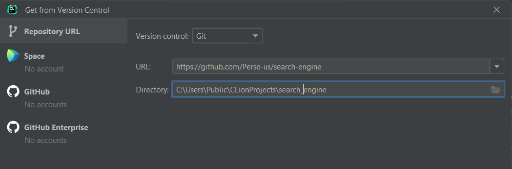
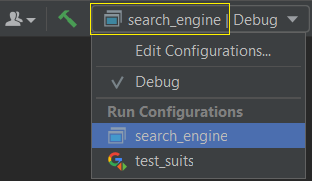

## SEARCH ENGINE

### Описание

Данное решение - итоговая учебная работа: 
**"Поисковый движок для сайта компании"**. 
Выполняет поиск текстовых документов, по переданным запросам, 
с определением поискового рейтинга (соответствия тексту запроса),
используя предварительную индексацию исходных текстов, 
с настройкой через файлы формата .json.

Поддерживает поиск по текстам, содержащим слова из латинских букв,
разделенные произвольными символами. Буквы в верхнем и нижнем регистре 
считаются эквивалентными.

- Для работы с файлами json используется решение
[JSON for Modern C++](https://github.com/nlohmann/json)
(входит в комплект поставки).

- Выборочное автоматизированное тестирование основных модулей выполнено с использованием
[GoogleTest - Google Testing and Mocking Framework](https://github.com/google/googletest)
(загружается как Fetch-content, при сборке).

### Установка 
###### (на примере среды разработки от JetBrains - CLion)

1) Для установки решения используйте инструмент загрузки из удаленного репозитория 
вашей IDE (адрес: https://github.com/Perse-us/search-engine), разместив исходные файлы 
в удобный каталог:

   

2) Выполните сборку приложения "search_engine"
(необходимо подключение к Интернет для загрузки Fetch):
   
   
3) В результате сборки, в каталоге проекта, будет сформирован исполняемый файл: 
`search_engine.exe`.

### Настройка и запуск
1) Перенесите исполняемый файл `search_engine.exe` в рабочий каталог;
2) Сформируйте и разместите конфигурационные файлы (описаны далее):
   - "config.json" - (обязательный) конфигурационная информация решения;
   - "requests.json" - файл со списком запросов (до 999);
3) Запустите исполняемый файл (команда: `search_engine.exe`) из каталога,
размещения конфигурационных файлов. При отдельном расположении исполняемого файла - укажите,
в команде, относительный путь до каталога исполняемого файла;
4) Для запуска решения необходимо наличие конфигурационной информации
и соответствие версий решения и конфигурационного файла;
5) При успешном запуске, в каталоге с конфигурационными файлами,
будет сформирован файл ответа (перезаписывается при каждом запуске):
   - "answers.json".

### Описание рабочих файлов (json)

---
#### "config.json" - файл конфигурационной информации. 
- "config" - конфигурационная информация, необходимая для запуса программы:
  - "name" - наименование решения;
  - "version" - версия конфигурационного файла;
  - "max_responses" - максимальное количество записей в ответе на запрос
    (значение по умолчанию: 5);
- "files" - список файлов, по которым выполняется поиск.
  
  Пример:
  
          {
             "config": {
                "name": "PerseusSearchEngine",
                "version": "1.0",
                "max_responses": 4
             },
             "files": [
                "../resources/file001.txt",
                "../resources/file002.txt",
                "../resources/file003.txt",
                "../resources/file004.txt",
                "../resources/file005.txt",
                "../resources/file006.txt"
             ]
          }
---
#### "requests.json" - файл со списком запросов:
- "requests" - список поисковых запросов (до 999).

  Пример:

         {
            "requests": [
               "baraban",
               "three",
               "Nothing, like this",
               "spectacles and nose"
            ]
         }
---
#### "answers.json" - файл ответа на переданные запросы.
- "answers" - список ответов на запросы поиска;
- "request001...999" - отдельные ответы в  порядке, соответствующем запросам в файле "request.json";
  - "result" - наличие документов, найденных по тексту запроса;
  - "relevance" - список результатов, при наличии нескольких, найденных, документов,
  в порядке убывания поискового рейтинга;
  - "docid" - Id документа, в порядке размещения в файле "config.json" (от 0);
  - "rank" - поисковый рейтинг документа
* Поля "docid" и "rank" размещаются в секции "request...", если найденный документ уникален
и отсутствуют, при отсутствии найденных документов.
 
   Пример:

       {
          "answers":{
             "request001":{
                "result":false
             },
             "request002":{
                "result":true,
                "docid":4,
                "rank":1.0
             },
             "request003":{
                "result":true,
                "relevance":[
                   {"docid":4,"rank":1.0},
                   {"docid":0,"rank":0.9},
                   {"docid":1,"rank":0.9},
                   {"docid":3,"rank":0.4}
                ]
             },
             "request004":{
                "result":true,
                "relevance":[
                   {"docid":4,"rank":1.0},
                   {"docid":1,"rank":0.939},
                   {"docid":0,"rank":0.727},
                   {"docid":3,"rank":0.424}
                ]
             }
          }
       }

---
### Дополнительные особенности работы кода
Код вызывает обрабатываемые исключения с выводом в поток ошибок консоли
- С прекращением обработки запроса:
  - При отсутствии файла "config.json";
  - При ошибке в формате файла и отсутствии секции "config" в файле "config.json";
  - При различии версии приложения и конфигурационного файла.
- Без прекращения обработки запроса:
  - При отсутствии файлов для построения индекса;
  - При отсутствии доступа к файлу для построения индекса;
  - При отсутствии файла "requests.json";
  - При ошибке в формате файла "requests.json";
  - При ошибке записи в файл "answers.json";
---
<h6 align="right">solution by Perseus<h6>